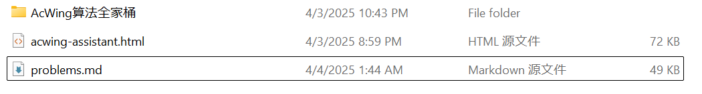
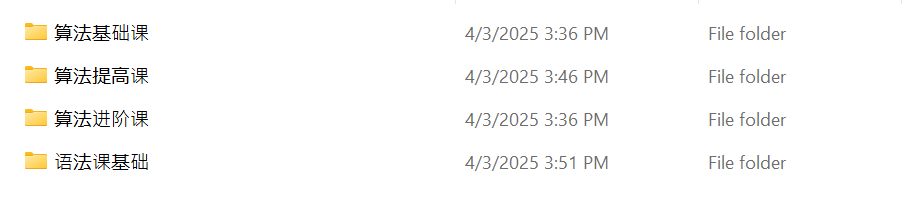
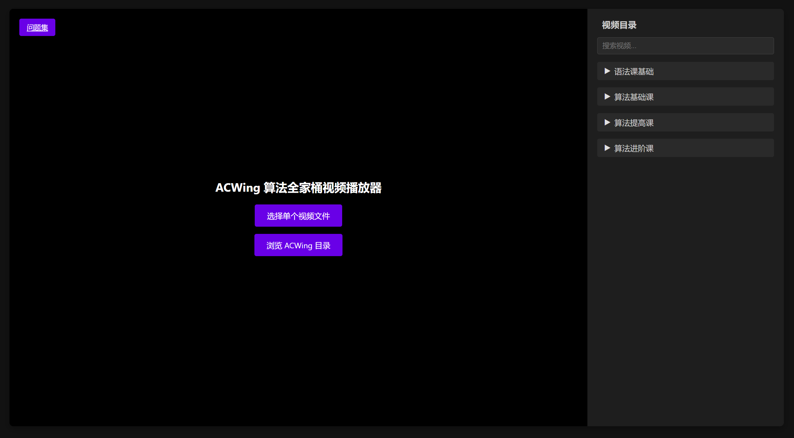
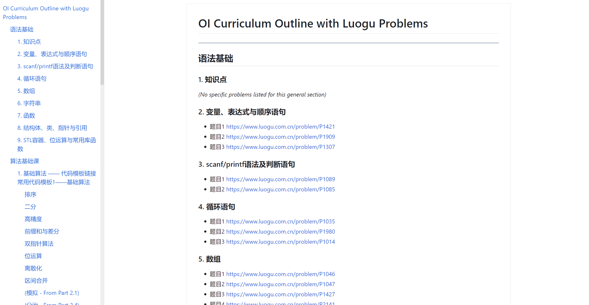

# acwing-assistant

A video player based on Web to learn algorithms elegantly.

May you savor elegance.

[Algorithm Learning Path](https://github.com/TecReaGroup/algrithm-icpc)

## How to use

Put `acwing-assistant.html` in the folder like this:

pay attention that simply rename the folder name

and then, open it in browser.

notes:

- it has added some problems in [problems.md](./problems.md), if possible, you can add more and PR.

References：

- https://www.acwing.com/about/

- https://www.luogu.com.cn/training/9391

- https://zhuanlan.zhihu.com/p/628020624
